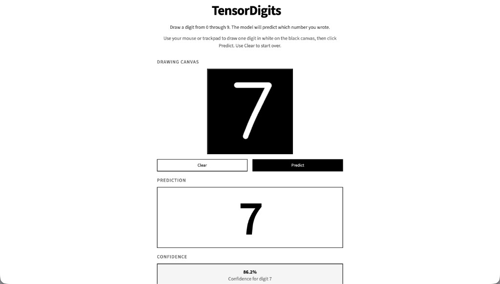
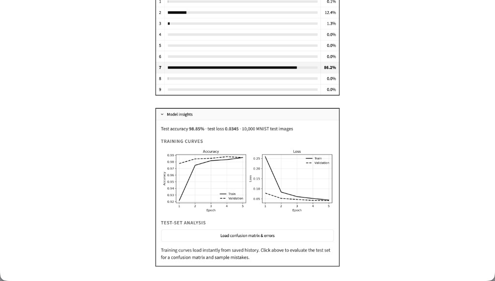

# TensorDigits

Interactive handwritten-digit recognition with **TensorFlow** and **Streamlit**.

Draw a digit from 0–9 on a black canvas. The app converts the stroke into an MNIST-compatible 28×28 image, runs it through a trained convolutional neural network, and returns the predicted digit with confidence scores for all ten classes.

**Test accuracy: 98.85%** on the 10,000-image MNIST test set (see `models/evaluation.json` after training).

## Project Preview



*Draw a digit, click Predict, and see the model’s top class with confidence.*



*Training history and evaluation metrics in a collapsed Model insights panel.*

## Project Architecture

```text
Training (offline)                         Inference (Streamlit app)
─────────────────                          ────────────────────────
MNIST dataset                              Drawing canvas (white on black)
      │                                           │
      ▼                                           ▼
train.py / src/training.py                 src/preprocessing.py
  • build CNN                                     │
  • evaluate                                      ▼
  • save artifacts                         saved CNN (.keras)
      │                                           │
      ▼                                           ▼
models/                                    digit + confidence
  digit_classifier.keras                     + probabilities 0–9
  training_history.json
  evaluation.json
```

**Layout:** `app.py` is the Streamlit UI; `src/` holds preprocessing, training, prediction, and insights; `train.py` retrains the model; `models/` stores artifacts; `assets/` holds screenshots and sample images; `tests/` covers preprocessing, prediction, training, and insights.

## Tech Toolbox

| Tool | Role |
|------|------|
| **Python 3.12** | Runtime (see `.python-version`) |
| **TensorFlow / Keras** | CNN training and inference |
| **Streamlit** | Interactive web UI |
| **streamlit-drawable-canvas** | Digit drawing canvas |
| **NumPy** | Array processing |
| **Pillow** | Image loading and transforms |
| **Matplotlib** | Training curves and confusion matrix |
| **pytest** | Automated tests |

No external API keys are required.

## Project Setup

Commands below assume you are in the repository root.

### 1. Clone

```bash
git clone https://github.com/tangdarren/tensor-digits.git
cd tensor-digits
```

### 2. Create and activate a virtual environment

```bash
python3.12 -m venv .venv
source .venv/bin/activate          # macOS / Linux
# .venv\Scripts\activate           # Windows
```

### 3. Install dependencies

```bash
python -m pip install --upgrade pip
python -m pip install -r requirements.txt
```

### 4. Train the model (required once)

Model weights and evaluation files are generated locally (they are not committed to git).

```bash
python train.py
```

This downloads MNIST, trains the CNN, and writes `models/digit_classifier.keras`, `models/training_history.json`, and `models/evaluation.json`.

### 5. Run the app

```bash
streamlit run app.py
```

Open the local URL shown in the terminal (typically http://localhost:8501).

### 6. Run tests

```bash
pytest
```

### Optional: retrain later

```bash
python train.py
```
